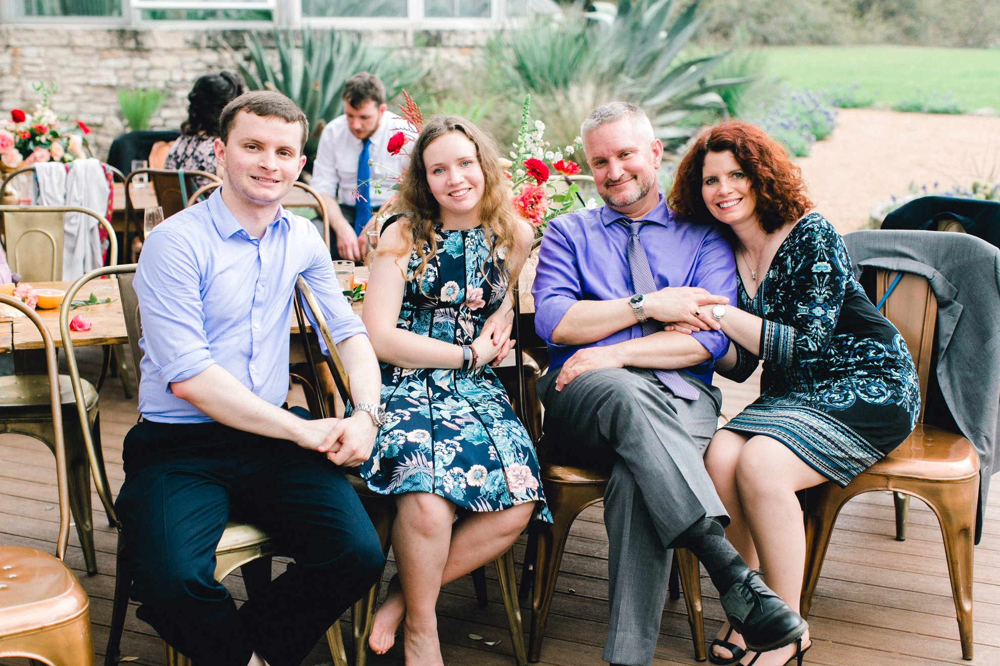
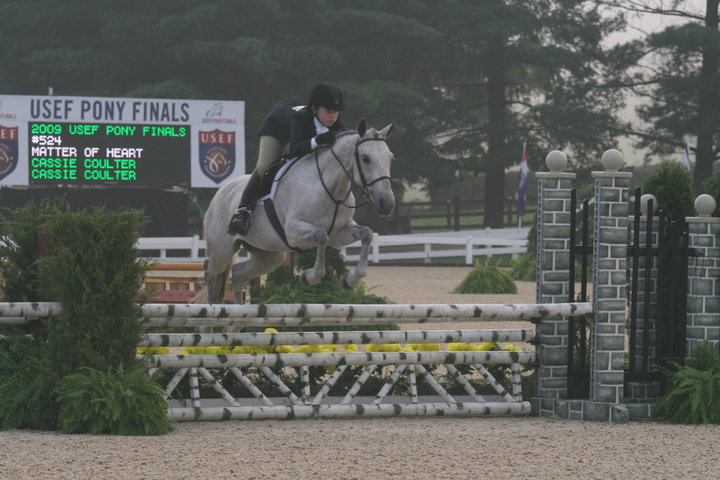

# HoMe

I'm a troll. I can show you where I grew up using just a hand. I know how to survive in subzero temperature winters and I'll start wearing T-shirts when it hits 50 degrees. Downpour or whiteout, I can handle the roads. I'll let you know when I see a cow. My family lives "Go Blue!". And I can't help but still say 'ope!' whenever I bump into someone. Even though I know longer live there, I am a Michigander through and through.

# Family

Everyone in my family has made significant life changes in the last few years. I now attend school in NYC, my parents have relocated and are now based out of Downingtown, PA, and my older brother recently began his master's program at Texas A&M. While family get togethers aren't as simple as they used to be, we work to stay in touch and always laugh until we drop.

# Travels

I love to travel abroad (need to do more of it) and hike! My first and most recent hiking adventure took me to Zion National Park and Escalante Grand National Staircase out west with my dad. We did the 3 of the hardest hikes in Zion in just 3 days! My next goals are Yosemite and Banff.

# Equestrian

I've been a competitive equestrian for the past 15 years, traveling throughout the Midwest to attend and work at nationally ranked shows. Starting on ponies, I worked my way up to horses, earning Grand Champion and year end awards in the state of Michigan. After graduating from high school, I had to sell my horse but continued to ride, both at my home barn and on the Michigan Equestrian Team, competing in the Intercollegiate Horse Show Association. The highlight of my IHSA career was attending the 50th annual Nationals Competition in 2017. Every summer through college I worked for my trainer as a groom, traveling with her and clients to shows to care for the horses, which allowed me the chance to remain in the horse show world and continue learning from top trainers and riders. Look below for a collection of some of my favorite memories with the horses I've worked with over the years.

