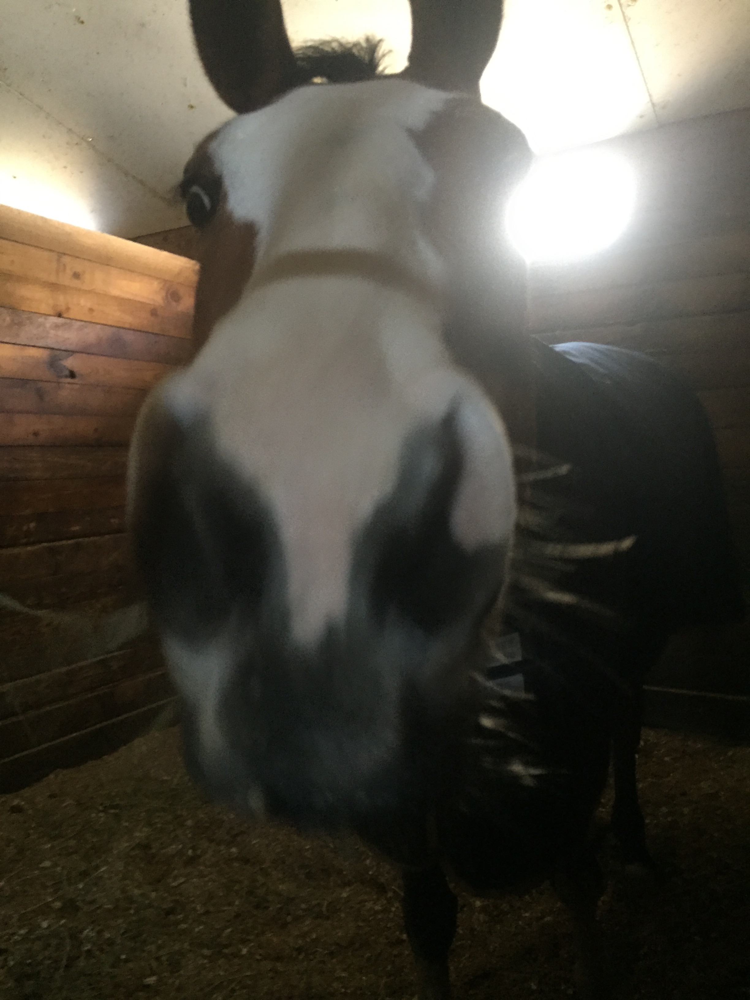

Read up on my professional and research experience in my [resume](resume.html), learn more [about](about.html) me before I became a public health student in NYC.

# Professional Networking

Connect with me on [Linkedin](https://www.linkedin.com/in/cassandra-coulter-225243a2/).

Check out the [Eco-Epidemiology lab](https://ecoepidemiologylab.e3b.columbia.edu) I work with at Columbia University in the City of New York.
