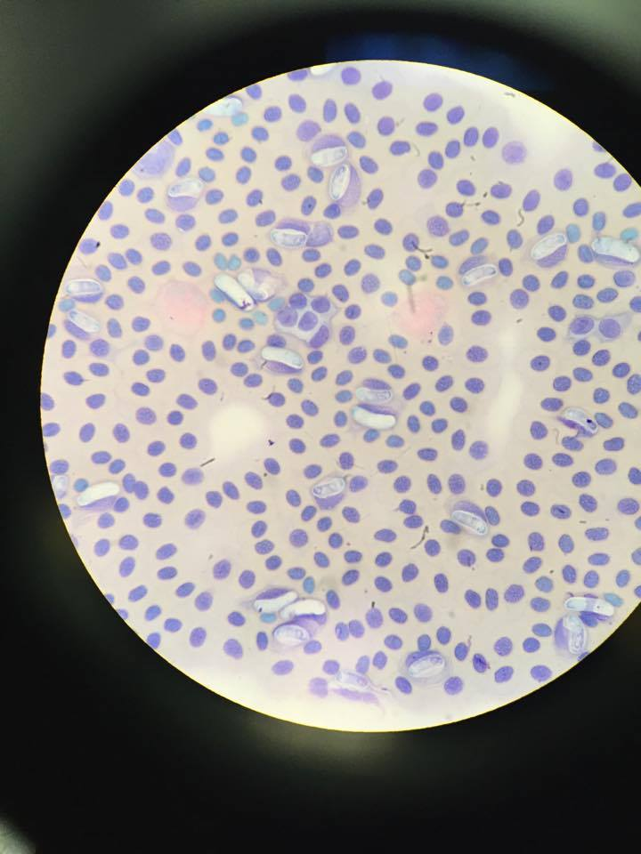

# Education

## University of Michigan
University of Michigan, April 2018
  B.S. Ecology, Evolution and Biodiversity; Environmental Science

## Columbia University
Columbia University Mailman School of Public Health, May 2020
  MPH Infectious Disease Epidemiology

# Research

## Columbia University
Lyme Disease in an Emerging Urban Area and an Endemic Area in Northeast United States
  Administered qualitative surveys to homewoners on Staten Island, NYC, a growing urban area and comparing their knowledge, attitudes, and prevention practices towards ticks and Lyme disease to residents from Block Island, RI, an endemic and substantially less urban area. Find [me](https://ecoepidemiologylab.e3b.columbia.edu/people/cassandra-coulter) in the Diuk-Wasser lab at Columbia.

## University of Michigan
Malarial Infection in *Podarcis erhardii* lizards
  Evaluate host response to malarial infection through video analysis of physical ability and assessing immune reponse with stained blood smears.

Biodiversity, Parasite Transmission, and Effects on Host Fitness in Coral Reef Fishes
  Dissected fish from remote archipelago to assess parasite diversity and burden using microscopes; furthermore, based on existing literature, developed a statistical model to assess how infection load impacted host fitness. Presented results at the National Conference for Undergraduate Research in 2015 and 2016.

# Professional Experience

## Columbia University Teaching Assistant (Sept-Dec 2019)
  As a TA for the Core's Determinants of Health course, I mentor 25+ students by disseminationg and elaborating on course content and grading assessments. Our TA and faculty team works with students to provide them a baseline understanding of the Social, Biological, and Environmental determinants of health.
  
## University of Michigan Peer Advisor (2015-2016)
  I was responsible for mentoring 13 students as they applied for and worked in research positions across campus. I made sure students met weekly work hour requirements, graded assessments, and planned seminars with faculty.

## Competition Groom (2015-2018)
  I traveled with my trainer to show venues throughout the Midwest, caring for client horses. Working in a team, we provided general, training, and medical care to our animals and adhered to show schedules, keeping staff and riders on track for their classes.
  
# Leadership

## Students for One Health (Dec 2018-Dec 2019)
  I am the Vice President of Columbia University's Students for One Health group based out of the Mailman School. We provide professional, academic, and social activities to students interested in the global One Health movement, which involves the confluence of work between human, wildlife, and environmental research.
  Visit our [Facebook group](https://www.facebook.com/columbiaonehealthinitiative/) to see what we have planned and what other One Health related events are taking place across the city!

## Michigan Equestrian Team (2016-2018)
  I was the Practice Coordinator for our 70 person team for 2 years, creating and maintaing lesson schedules and practice schedules, organizing teammembers at competitions, and training riders of all levels how to work with and ride horses.